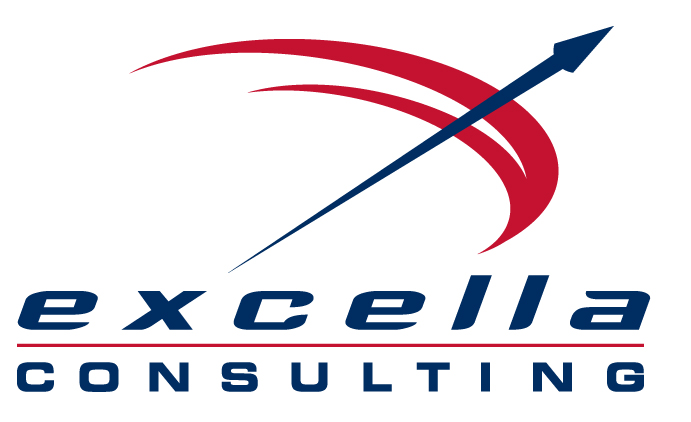

# [.NET Tech Radar, Summer 2017](http://radar.labsincubator.com/?sheetId=https%3A%2F%2Fdocs.google.com%2Fspreadsheets%2Fd%2F1nodW2q6Is-A-Cw7h7d3drneVHuRMP-zhPYEU0o1_Qqg)

We have developed a Tech Radar for the .NET landscape, using knowledge gained through our experience, our thought leaders and advice from thought leaders in the community. We're passionate about .NET and have a lot of experience in it, and are excited about the vast changes that are taking place, so are trying to do our part to help make sense of it all. 

## .NET Core 

One theme of this radar is that .NET Core is looking more like the clear future for Microsoft for general development, and the 2.0 release may be considered the real version 1.0, so it's definitely something to consider in your future solution stratigies. Even if you aren't a .NET shop, you can now consider .NET Core as a performant, cloud-optimized platform for anything from small websites, background services to microservices. 

.NET Core is considered production-ready, and a roadmap in how you'll get there should be in place or made soon, with small projects with .NET Core being tested. Deployment options are much greater than with IIS. Being cross-platform, Linux and container-based deployments are possible and quite workable. It can fit in seamlessly with other technologies such as Node.js, Go as far as deployment and workflow. 

.NET Core development on MacOS or Linux is a perfectly reasonable possibility and works well. Visual Studio Code has established itself as a top IDE for a wide range of languages, and Visual Studio 2017 has made some great performance improvements and should be sought if your shop is on VS. ReSharper is still a no-brainer if you're using VS. 

## Containers 

Containers are a main focus at Microsoft now, not just with the new Windows Containers, but the container landscape from .NET Core being able to run in Linux containers and be deployed anywhere along with traditionally Linux-only packages, to any app in a container being deployable in Azure. 

## Azure 

Azure is another main focus, which we should continue to see fast growth and matching of AWS capabilities. Cosmos is an interesting addition in a flexible, horizontally scalable NoSQL data store. There is a lot of focus on containers here too, with Docker for Azure and Azure Container Service that supports third-party orchestrators such as Kubernetes and Swarm. 

The future is quite shifting in the .NET world, which is very exciting since many of the changes seem to be going in the right direction. 

## > [View the Radar](http://radar.labsincubator.com/?sheetId=https%3A%2F%2Fdocs.google.com%2Fspreadsheets%2Fd%2F1nodW2q6Is-A-Cw7h7d3drneVHuRMP-zhPYEU0o1_Qqg)

